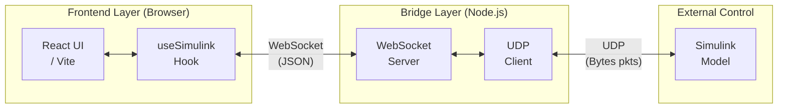

# Beam Ball Game 🎮

A high-performance physics-based balancing game built in React with dual-control modes: **hand tracking** via webcam or **external control** via Simulink integration for **biomechanical research** and **shared control** for examining human motor dexterity and machine interaction.

---

## ▶️ Quick Start

**Option A — Play Online Now**  

👉 Open [beamball.surge.sh](https://beamball.surge.sh) in your browser and start playing with hand tracking immediately.

**Option B — Local Development**  
```bash
git clone https://github.com/ylahdili/Co.Re.Lab-Beam-Ball-Balancing-via-Simulink-UDPwebhook-or-MediaPipe.git
cd Co.Re.Lab-Beam-Ball-Balancing-via-Simulink-UDPwebhook-or-MediaPipe
npm install
npm run dev
```
Then open `http://localhost:3000` in your browser, to launch the game.

---

## 🔌 Simulink Control Mode

To control the game from a Simulink model, you need to run a local bridge that translates WebSocket ↔ UDP:

### Step 1: Download & Run the Bridge
```bash
mkdir simulink-bridge && cd simulink-bridge
wget "https://raw.githubusercontent.com/ylahdili/Co.Re.Lab-Beam-Ball-Balancing-via-Simulink-UDPwebhook-or-MediaPipe/main/simulinkBridge/bridge.js" -O "bridge.js"
wget "https://raw.githubusercontent.com/ylahdili/Co.Re.Lab-Beam-Ball-Balancing-via-Simulink-UDPwebhook-or-MediaPipe/main/simulinkBridge/package.json" -O "package.json"
npm install
node bridge.js
```
> 💡 Keep this terminal open while playing.

### Step 2: Get the Simulink Model
The Simulink model is provided on request. Contact the repository maintainer for access.

### Step 3: Play
Open the game (online or local), toggle **Control Source** to `SIMULINK` in the side panel, and start your Simulink model, or toggle to `CAMERA` to use hand tracking for tilting both ends of the beam, then make sure both your hands are visible to the camera.

---

## 🎮 Controls

| Mode | Control |
|------|---------|
| **Camera** | Left/Right index finger tips move left/right beam ends |
| **Simulink** | UDP packets with `Float32LE` Y-coordinates for each beam tip |

**Scoring:** Keep the beam angle within ±3° to accumulate **Stability** points.

---

## 🏗️ Architecture

The game utilizes a low-latency bridge to connect the web-based game UI with the Simulink environments.



- **Telemetry (Game → Simulink):** 21-byte packet @10Hz — Score, Health, Ball XY, Left Y and Right Y Beam tips positions, Game State
- **Control (Simulink → Game):** 9-byte packet @60Hz (*i.e. the physics engine fps*) — Left Y, Right Y, Start command Trigger

This flexible architecture and documented code lends itself very well to be expanded to other byte-sized quantities.

---

## 🛠️ Tech Stack

| Layer | Technology |
|-------|------------|
| Frontend | React 19, Vite, Tailwind CSS, Canvas 2D |
| Hand Tracking | MediaPipe Hands (*Lite for Performance*) |
| Bridge | Node.js, WebSocket (`ws`), UDP (`dgram`) |

---

## 🧪 Debugging Tools (Optional)

If you need to verify the bridge is working:

```bash
# Simulate Simulink sending control signals
wget "https://raw.githubusercontent.com/ylahdili/Co.Re.Lab-Beam-Ball-Balancing-via-Simulink-UDPwebhook-or-MediaPipe/main/simulinkBridge/test_sender.js" -O "test_sender.js"
node test_sender.js

# Listen for telemetry from the game
wget "https://raw.githubusercontent.com/ylahdili/Co.Re.Lab-Beam-Ball-Balancing-via-Simulink-UDPwebhook-or-MediaPipe/main/simulinkBridge/test_receiver.js" -O "test_receiver.js"
node test_receiver.js
```

---

*Developed for the Nisa Project & Eurostars Research — v4.2*
