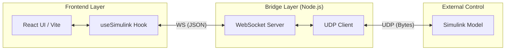

# Beam Ball for Nisa

A high-performance physics-based balancing game built with React, featuring dual-control modes: visual hand tracking and real-time Simulink integration targeting biomechanical research.

## 📝 Overview

**Beam Ball** is designed for a unique interactive experience. It captures two-player gamepad inputs processed through Simulink using advanced learning paradigms. These inputs are then transmitted as force components to command a balancing beam in a 60fps physics simulation.

The project is extensible to include an AI co-pilot (Gemini 3 Flash) to analyze the game snapshots and suggest optimal balancing and swerving strategies for future skills improvements.

---

## 🚀 Key Features

- **60 FPS Physics Engine**: Smooth, deterministic ball-and-beam physics built with React and HTML5 Canvas.
- **Dual Control Paradigms**:
  - **Vision Mode**: Real-time hand tracking using MediaPipe (Index finger tip control).
  - **Simulink Mode**: External control via UDP signals for specialized controller testing.
- **Optimized Telemetry**: Real-time game state data (Score, Health, Ball Position) transmitted to Simulink, throttled at **100ms (10Hz)** to maximize computational efficiency while maintaining enough data logging throughput.
- **Dynamic Visuals**: Adaptive HUD, particle system explosions, and real-time beam tilt visualization.

---

## 🏗️ Architecture

The game utilizes a low-latency bridge to connect the web-based UI with the Simulink environments.



---

## 🛠️ Installation & Setup

### 1. Prerequisites
- [Node.js](https://nodejs.org/) (v16.0.0 or higher)
- [Git](https://git-scm.com/)
- A webcam (for vision-based control)

### 2. Clone the Repository
Open your terminal and run:
```bash
git clone https://github.com/USER/beam-ball-game.git
cd beam-ball-game
```

### 3. Install Dependencies
```bash
npm install
```

---

## 🚥 Deployment & Running

To experience the full integration, you must run both the application and the communication bridge.

### Step 1: Start the Simulink Bridge
The bridge facilitates low-latency communication between the browser and Simulink.
```bash
node simulinkBridge/bridge.js
```
*Note: Ensure your Simulink model is configured to listen on port 3000 and send on port 3001.*

### Step 2: Launch the Game
In a separate terminal, start the development server:
```bash
npm run dev
```
Navigate to `http://localhost:3000` in your browser.

---

## 🎮 Controls

### Simulink Mode (Default mode for scientific experiments)
- Inputs are received as `Float32LE` values representing target Y-coordinates for both beam tips.
- Toggle the **Control Source** switch in the System Diagnostics panel to try the Vision Mode where it tracks your hands on camera.

### Vision Mode (Camera)
- Use your **Left Index Finger** to control the Left Tip of the beam.
- Use your **Right Index Finger** to control the Right Tip of the beam.
- Keep the beam leveled with an angle no more than 3.0° to increase your **Stability** score.

---

## 🛠️ Technical Specifications

- **Frontend**: React 19, Vite, Tailwind CSS, Lucide Icons.
- **Tracking**: MediaPipe Hands (Lite Model for performance).
- **Communication**: WebSocket (Browser-to-Bridge), dgram/UDP (Bridge-to-Simulink).
- **Protocol**: 21-byte compact UDP packet structure for telemetry (Score, Health, Ball Position, Beam Position, Game State) and easily expandable to other byte-sized quantities.

---

*Developed for the Nisa Project and Eurostars Research Project - Build v4.2*
